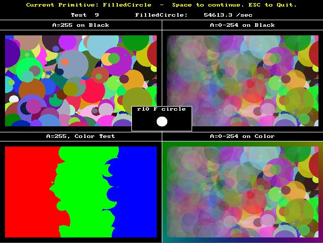

# SDL2_gfx

Library containing 20+ graphics primitives (line, box, circle, polygon,...) for SDL2.



## Contact and License

Email aschiffler at ferzkopp dot net to contact the author or check author's homepage at http://www.ferzkopp.net 
for the most up-to-date contact information.

This library is licenced under the same terms as the [zlib License](http://www.zlib.net/zlib_license.html).

## Introduction

The SDL2_gfx library provides the basic drawing functions such as lines,
circles or polygons provided by SDL_gfx on SDL2 against renderers of SDL2.

The current components of the SDL2_gfx library are:
- Graphic Primitives (SDL2_gfxPrimitives.h, SDL2_gfxPrimitives.c)
- Surface Rotozoomer (SDL2_rotozoom.h, SDL2_rotozoom.c)
- Framerate control (SDL2_framerate.h, SDL2_framerate.c)
- MMX image filters (SDL2_imageFilter.h, SDL2_imageFilter.c)
- Build-in 8x8 Font (SDL2_gfxPrimitives_font.h)

Note that SDL2_gfx is compatible with SDL version 2.0 (not SDL 1.2).

## Installation

### Windows

Open the SDL2_gfx.sln solution file with VS2022, right click on the solution and choose 'Rebuild'.

The SDL folder must be placed in a directory alongside SDL2_gfx and build in the same configuration, 
i.e. Debug or Release, beforehand so the referenced SDL2.lib file can be found.

### Unix/Linux

TBD

#### Linker Configuration

TBD

#### MMX Code

Do not define ```USE_MMX``` precompiler flag on non-MMX platform such as ARM as well as x64.

## Tests

Several test programs for the libraries functions can be found in the ```Tests``` folder. 
See the source in the Tests/*.c files for some sample code and implementation hints.

Test code may require the SDL2_gfx library to be previously compiled and installed.

## Documentation

Refer to the Doxygen-generated API documentation found in the ```Docs/html``` folder as well as the test programs.

## Change Log

- Sun, Feb 11, 2018  16:55:00 PM
  - version rev to 1.0.4
  - fix int overflow in ellipseRGBA for large radii (thanks for reporting David)
  - fix aaline wrong direction hline bug (thanks Andre)
  - fix off-by-1 error in rotateSurface90Degrees (thanks Austin)
- Mon, Feb 20, 2017  9:04:29 PM
  - version rev to 1.0.3
  - updates to VS solution
  - update README for VS2015
  - fix to rotozoomSurfaceSizeTrig (thanks hydren)
  - fix for special case of roundedBoxRGBA (thanks LukeMS)
- Thu, Dec 10, 2015  8:11:26 AM
  - added XCode.zip (thanks Matthias for contributing)
- Sun, Jul 13, 2014  9:21:00 AM
  - added TestFramerate
- Fri, Jul 11, 2014  7:33:12 PM
  - rewrote thick line algorithm using polygon drawing (much less code and faster than original Murphy-Bresenham algorithm)
  - update TestThickLine accuracy test in TestGfx
  - update file headers
Fri, Jul 04, 2014  4:00:21 PM
  - rewrote ellipse algorithm used by non-AA line/filled circle/ellipse functions: integer midpoint algorithm with 4x overscan for visual accuracy
  - fix bugs in TestGfx
  - add screenshot image
- Sun, Jun 15, 2014  3:12:31 PM
  - fixed roundedBox by rewriting algorithm and base it on filledCircle
  - fixed textured polygon algorithm
  - updated testgfx extensively (visual accuracy tests, updated tests for textured polygon)
  - updated README
- Mon, Jun 09, 2014  8:48:50 AM
  - removed VS2010 solution files; updated VS2012 solution files for SDL2 updates
- Mon, Jun 02, 2014  7:36:24 AM
  - add patch for pkg-config support (thanks Sylvain)
  - update tests to use SDLTest library
  - fix commandline parsing in testgfx
- Mon, May 12, 2014  7:29:24 AM
  - fixed BoxRGBA size-off-by-1 error (thanks Stefan for reporting)
- Sun, Feb 02, 2014 12:00:00 PM
  - fixed and optimized rotateSurface90Degrees
  - updated testrotozoom to allow specification of test range
- Sun, Nov 03, 2013 10:11:16 AM
  - updated testgfx program for benchmarking primitive rendering performance
  - updated test programs based on VS warnings
  - fixed VS2012 solution for Release build
- Mon, Oct 28, 2013  8:00:05 AM
  - bugfix to _aaline special cases
  - added image filter functions
  - added to documentation
  - updated readme and changelog
  - updated solutions for VS2010 and VS2012
- Tue, Sep 04, 2012  8:27:44 AM
  - initial release of development version (partially finished)
